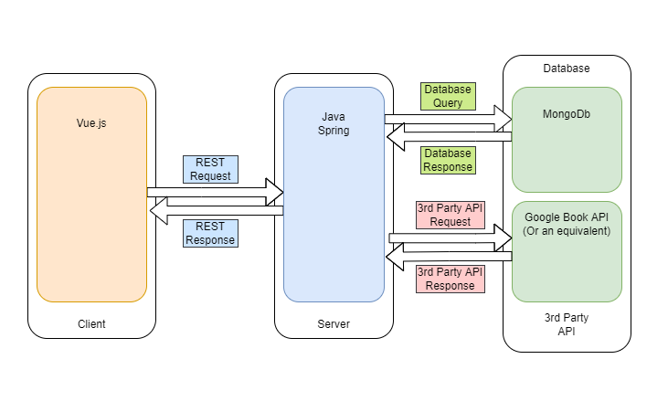

# BookWyrm

## Team Members

| Name | GitHub Username | Email 
| --- | --- | --- |
| Luke Morrow | LukeBMorrow | morrowl4@myumanitoba.ca
| Cameron Jung | CameronJung | jungc@myumanitoba.ca
| Gurtej Boparai | gurtejboparai | boparai3@myumanitoba.ca
| Long Vu | louismacvux | vuml@myumanitoba.ca
| Antony Anuraj | antonyanuraj | anuraja@myumanitoba.ca

## Team Leader: 

### Description
Book Wyrm will be a web app for reviewing books.

### Languages and Tools

### Meeting Notes
* Meeting notes can be found [here](https://github.com/louismacvux/bookwyrm/wiki/Meetings).

### System Architecture Design



### Test the site 

### Vue setup
1. 

### Front end Project setup
> Note: Node and npm will need to be installed to start the front end server

```
npm install
```

#### Compiles and hot-reloads for development
```
npm run serve
```

#### Compiles and minifies for production
```
npm run build
```

#### Lints and fixes files
```
npm run lint
```

#### Customize configuration
See [Configuration Reference](https://cli.vuejs.org/config/).